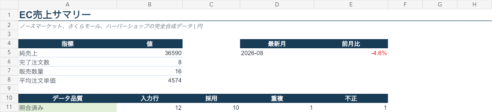

# EC売上データ自動化

[English / 英語](README.md)

現在の状態：Phase 27完了（ローカルReleaseパッケージと公開準備監査まで完了、未公開）

列名、日付形式、ステータス表現が異なる複数店舗のCSVを、共通形式へ変換して集計するポートフォリオです。開発・デモには完全合成データだけを使用しています。



## 解決する作業

手作業では、店舗ごとのCSVを開き、列を並べ替え、日付・金額・キャンセル・返金を確認し、重複を除外してから集計表とグラフを更新します。

本ツールは次の処理を自動化します。

```text
複数形式のCSV
      ↓
入力検証・個人情報列の拒否
      ↓
列名・日付・金額・状態の統一
      ↓
重複・不正行の記録
      ↓
月別・店舗別・商品別集計
      ↓
統合CSV・品質JSON・集計JSON
```

Excel見本には、日本語版と英語版があります。同じ正規化処理と同じ数値を使い、見出し、店舗名、商品名、状態だけを表示言語に合わせています。

## サンプル結果

| 項目 | 結果 |
|---|---:|
| 入力行 | 12 |
| 採用行 | 10 |
| 重複行 | 1 |
| 不正行 | 1 |
| 純売上 | 36,590円 |
| 完了注文数 | 8 |

サンプルには、重複、キャンセル、返金、不正な数量を意図的に含めています。

## 実行方法

Python 3.11以降を使用します。CSV・JSON処理部分に外部実行ライブラリはありません。

```bash
python3 -m venv .venv
source .venv/bin/activate
python -m pip install .
ec-sales --input sample_data/input --output output --contract config/source_contracts.json
```

生成物：

- `clean_data.csv`：正規化済みデータ
- `quality_report.json`：採用・重複・不正の照合結果
- `report_model.json`：集計結果

Excel生成は現在、管理された開発環境で行うデモ工程です。任意のPCでExcelまで生成できるとは説明しません。

## 安全上の制約

- 実在企業の内部データ、顧客データ、勤務先データを使用しません。
- 架空の店舗名・商品名だけを使用します。
- 氏名、住所、メール、電話、カード情報らしい列を検出した場合は、ファイル単位で処理を停止します。
- 会計・税務上の正確性を保証する製品ではありません。

## テスト

```bash
PYTHONPATH=src python3 -m unittest discover -s tests -v
./scripts/smoke_clean_install.sh
```

Python 3.11〜3.13向けのCI設定も含まれています。

## 公開成果物

`v0.1.0`では日本語版・英語版Excelを同梱する想定です。リポジトリには生成Excelをコミットせず、公開時にRelease添付ファイルとして提供します。チェックサム付きのローカルReleaseパッケージは `scripts/package_release.sh` で作成できます。
