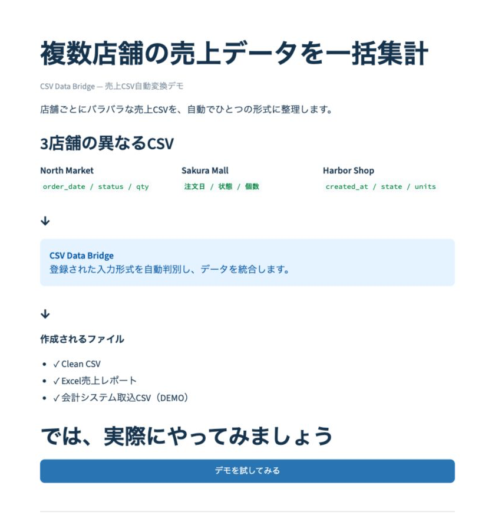
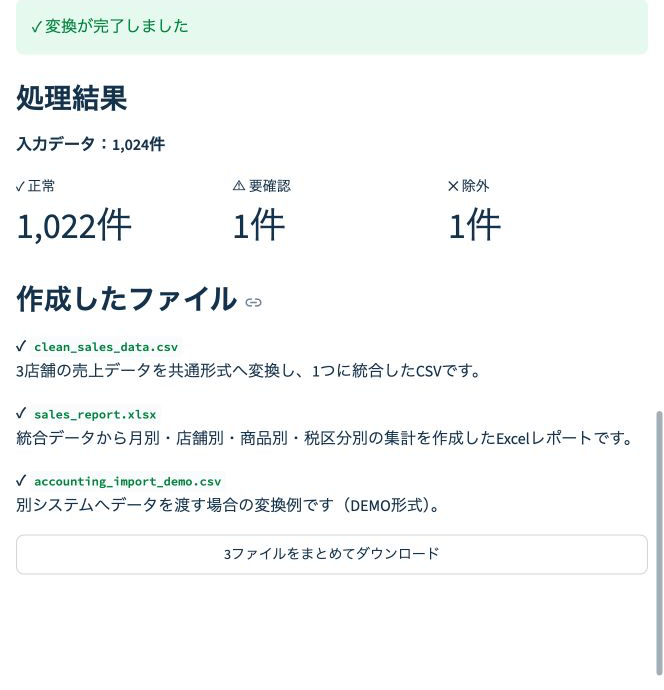
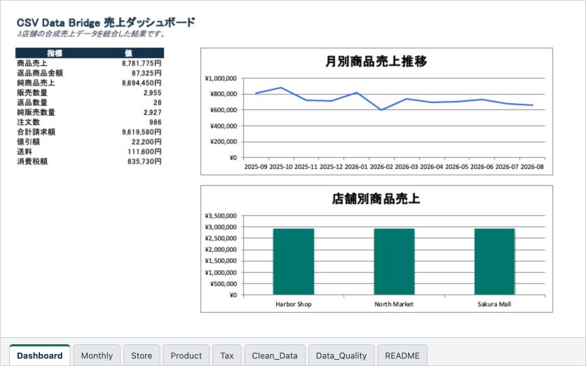

# 複数店舗の売上データを一括集計

CSV Data Bridge — 売上CSV自動変換デモ

[English / 英語](README.md)

店舗ごとに列名・日付形式・ステータス表現が異なる売上CSVを、共通形式へ整理してExcel集計まで一括作成するデモです。毎月の転記、列の並べ替え、重複確認、集計表の更新といった定型作業を、再実行できる処理へ置き換えます。

このPortfolioでは、3店舗・1,024行の完全架空データを使用しています。実在企業・顧客・マーケットプレイスのデータやロゴは使用していません。



## このデモで確認できること

- 異なる3種類のCSVをヘッダーから判別し、1つの共通データへ変換
- 不正行と完全重複を黙って補正せず、処理結果として明示
- 元ファイル名・元行番号・入力ハッシュを残した追跡可能なデータ作成
- 統合CSV、数式連動Excelレポート、会計システム取込CSV（DEMO）の出力
- 月別・店舗別・商品別・税区分別の集計とDashboardの自動作成

## 想定するご相談

手作業では、店舗ごとのCSVを開き、列を並べ替え、日付・金額・キャンセル・返金を確認し、重複を除外してから集計表とグラフを更新します。

このデモは、次のようなCSV整理・Excel集計案件を想定しています。

- 複数店舗や複数システムのCSVを毎月1つにまとめたい
- 列名や日付形式の違いを一定のルールで変換したい
- 重複、不正行、キャンセル、返金を確認できる形で処理したい
- 集計表とグラフを手作業で更新する時間を減らしたい

処理の流れ：

```text
複数形式のCSV
      ↓
入力検証・個人情報列の拒否
      ↓
列名・日付・金額・状態の統一
      ↓
重複・不正行の記録
      ↓
月別・店舗別・商品別集計
      ↓
統合CSV・Excelレポート・会計取込CSV（DEMO）
```



Excelレポートは `Clean_Data` を計算元にし、月別・店舗別・商品別・Dashboardを数式で連動させています。



## サンプル結果

| 項目 | 結果 |
|---|---:|
| 入力行 | 1,024 |
| 採用行 | 1,022 |
| 重複行 | 1 |
| 不正行 | 1 |
| 商品売上 | 8,781,775円 |
| 返品商品金額 | 87,325円 |
| 純商品売上 | 8,694,450円 |
| 販売数量 | 2,955 |
| 返品数量 | 28 |
| 純販売数量 | 2,927 |
| 完了注文数 | 986 |
| 合計請求額 | 9,619,580円 |
| 消費税額 | 835,730円 |

サンプルには、重複、キャンセル、返金、不正な数量を意図的に含めています。

## 実行方法

Python 3.11以降を使用します。CSV・JSON処理部分に外部実行ライブラリはありません。

```bash
python3 -m venv .venv
source .venv/bin/activate
python -m pip install .
ec-sales --input sample_data/input --output output --contract config/source_contracts.json
```

生成物：

- `clean_data.csv`：正規化済みデータ
- `quality_report.json`：採用・重複・不正の照合結果
- `report_model.json`：集計結果

Webアプリの追加依存関係をインストールすると、画面からExcelレポートも生成できます。

## 安全上の制約

- 実在企業の内部データ、顧客データ、勤務先データを使用しません。
- 架空の店舗名・商品名だけを使用します。
- 氏名、住所、メール、電話、カード情報らしい列を検出した場合は、ファイル単位で処理を停止します。
- 会計・税務上の正確性を保証する製品ではありません。

## テスト

```bash
PYTHONPATH=src python3 -m unittest discover -s tests -v
./scripts/smoke_clean_install.sh
```

Python 3.11〜3.13向けのCI設定も含まれています。

## Web画面の起動

```bash
python3 -m venv .venv
source .venv/bin/activate
python -m pip install -r requirements.txt
python -m streamlit run app.py
```

操作は次の4段階です。

1. CSVを複数ドロップ、またはサンプルデータを選択
2. Clean CSV、Excel、会計DEMOから出力形式を選択
3. 「変換する」を押す
4. 単一ファイルまたはZIPをダウンロード

Excelの `Monthly`、`Store`、`Product`、`Tax` は `Clean_Data` を数式参照し、`Dashboard` は `Store` 集計を参照します。商品売上・返品・値引・送料・消費税・合計請求額を区別して表示します。

Accounting DEMOは実在会計製品の正式仕様ではありません。実案件ではお客様の取込仕様に合わせてOutput Adapterを調整します。

このPortfolioは、対応可能な業務の考え方と実装例を示すものです。任意のCSVへの無調整対応、本番運用、会計・税務上の正確性を保証するものではありません。

## 公開成果物

`v0.1.0`では日本語版・英語版Excelを同梱する想定です。リポジトリには生成Excelをコミットせず、公開時にRelease添付ファイルとして提供します。チェックサム付きのローカルReleaseパッケージは `scripts/package_release.sh` で作成できます。
