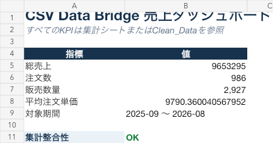

# CSV Data Bridge

[日本語](README.ja.md) | English

A local Streamlit app that turns multiple incompatible CSV exports into a clean canonical CSV, a formula-linked Excel report, and a fictional accounting-import CSV.

> Different CSV layouts in, validated management workbook out.



## Project status

- Current phase: Phase 28 complete — CSV Data Bridge MVP implemented and verified locally
- Gate decision: **GO with conditions**
- Implementation: synthetic sample E2E complete
- Canonical scope: [`docs/01_product_brief.md`](docs/01_product_brief.md)
- Gate record: [`docs/04_implementation_gate.md`](docs/04_implementation_gate.md)

## Hard boundaries

- Use only wholly synthetic input data created from scratch.
- Do not use internal company data, customer data, private documents, source code, or logs.
- Keep this project isolated from `argo-core` and all employer-related repositories.
- Use fictional store and product names, with no third-party marketplace branding or affiliation claims.

## Operation

```text
Drop multiple CSV files
        ↓
Select one or more output formats
        ↓
Convert and download one file or one ZIP
```

## Before / After

Before:

- Each shop exports a different schema, date format, and status vocabulary.
- Duplicate rows, cancellations, refunds, and malformed values require manual decisions.
- Monthly copy/paste, aggregation, and chart updates are repetitive.
- Excluded rows are difficult to trace after the report is produced.

After:

- Convert each configured source schema into one canonical format.
- Reconcile every input row as accepted, duplicate, or rejected.
- Aggregate sales, orders, units, and month-over-month movement automatically.
- Produce Clean CSV, a formula-linked Excel report, an Accounting DEMO CSV, or a ZIP.
- Preserve source filename, source row number, and input SHA-256 lineage.

## Documents

- [`docs/01_product_brief.md`](docs/01_product_brief.md) — canonical v1 scope
- [`docs/04_implementation_gate.md`](docs/04_implementation_gate.md) — implementation decision and conditions
- [`docs/05_data_contract.md`](docs/05_data_contract.md) — source and output contracts
- [`docs/08_compatibility_report.md`](docs/08_compatibility_report.md) — office-suite compatibility
- [`docs/10_distribution_decision.md`](docs/10_distribution_decision.md) — public distribution model
- [`docs/12_bilingual_strategy.md`](docs/12_bilingual_strategy.md) — Japanese/English presentation strategy
- [`docs/14_release_readiness.md`](docs/14_release_readiness.md) — local release package and publication boundary
- [`docs/15_csv_data_bridge_mvp.md`](docs/15_csv_data_bridge_mvp.md) — MVP completion evidence
- [`docs/16_csv_data_bridge_formal_spec_v0.1.md`](docs/16_csv_data_bridge_formal_spec_v0.1.md) — formal Portfolio #1 specification v0.1

## Run the portable sample

Python 3.11+ is required. The portable pipeline has no third-party runtime dependencies.

Install the command in a virtual environment:

```bash
python3 -m venv .venv
source .venv/bin/activate
python -m pip install .
```

```bash
./scripts/run_portable_sample.sh
```

### Direct command

The validation and aggregation pipeline uses only the Python standard library and can run without the workbook runtime:

```bash
PYTHONPATH=src python3 -m ec_sales.cli \
  --input sample_data/input \
  --output output \
  --contract config/source_contracts.json
```

Generated files are written to `output/`:

- `clean_data.csv`
- `quality_report.json`
- `report_model.json`

## Run the web app

```bash
python3 -m venv .venv
source .venv/bin/activate
python -m pip install -r requirements.txt
python -m streamlit run app.py
```

Open the displayed local URL, upload the three sample CSVs or select the sample-data option, choose the outputs, and press **変換する**.

Available outputs:

- `clean_sales_data.csv` — UTF-8 BOM canonical data
- `sales_report.xlsx` — formula-linked Dashboard, Monthly, Channel, Product, Clean_Data, Data_Quality, and README sheets
- `accounting_import_demo.csv` — fictional mapping demonstration, not compatible with any real accounting product
- `csv_data_bridge_output.zip` — one download when multiple outputs are selected

Run the dependency-free Python tests with:

```bash
PYTHONPATH=src python3 -m unittest discover -s tests -v
```

## Sample reconciliation

| Measure | Result |
|---|---:|
| Input rows | 1,024 |
| Accepted rows | 1,022 |
| Excluded duplicate rows | 1 |
| Rejected rows | 1 |
| Net sales | ¥9,653,295 |
| Completed orders | 986 |

The totals above are fixture expectations verified by automated tests. The twelve-month sample contains 24 fictional products, cancellations, refunds, one exact duplicate, and one malformed quantity.

## Architecture

```text
Configured source adapters
          ↓
CSV validation and sensitive-column guard
          ↓
Canonical rows with source lineage
          ↓
Duplicate handling and row reconciliation
          ↓
Deterministic sales aggregates
          ↓
CSV + JSON + Excel report
```

## Limitations

- v1 accepts only the three documented fictional schemas.
- All values use JPY; currency conversion is out of scope.
- The project does not provide accounting or tax advice.
- The web app installs Streamlit and its Excel-writing dependency through the `app` optional dependency group.
- Accounting DEMO is intentionally fictional and requires a customer-specific adapter for real use.
- Portfolio development uses synthetic data only. Do not add customer or employer data.

## License

Project-authored source and documentation are available under the MIT License. Third-party components retain their respective licenses.

## Data relationship

The workbook uses `Clean_Data` as its calculation source. Row-level gross and net sales are formulas, Monthly/Channel/Product use `SUMIFS`, Dashboard references the aggregate sheets, and an independent Dashboard check compares all net-sales totals.

## Notice

The Prior Art/IP review in this repository is an initial risk screen, not legal advice or a freedom-to-operate opinion.
