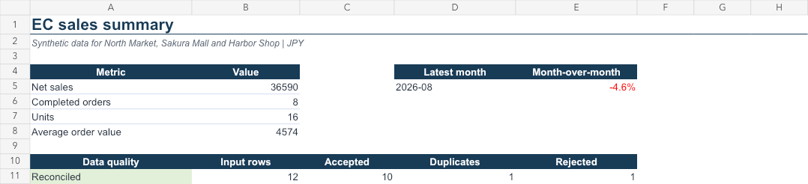

# EC Sales Data Automation

[日本語](README.ja.md) | English

複数のECショップから出力された、列名・日付・金額表現などが異なるCSVを、ローカル環境で統合・クレンジング・集計し、Excelレポートへ変換するポートフォリオプロジェクトです。

> Different CSV layouts in, validated management workbook out.



## Project status

- Current phase: Phase 25 complete — pre-commit audit and bilingual report verification
- Gate decision: **GO with conditions**
- Implementation: synthetic sample E2E complete
- Canonical scope: [`docs/01_product_brief.md`](docs/01_product_brief.md)
- Gate record: [`docs/04_implementation_gate.md`](docs/04_implementation_gate.md)

## Hard boundaries

- 入力データはゼロから生成した完全合成データのみを使用する。
- 実在企業の内部データ、顧客データ、非公開資料、コード、ログを使用しない。
- EV、CAN、BMS、OBC、VCU、車両診断・充電器解析など本業領域を扱わない。
- `argo-core` その他の本業関連リポジトリから、コード・設定・データをコピーしない。
- Amazon、楽天など第三者のロゴ、画面、商標を成果物に使用しない。サンプル店舗は架空名にする。

## Target user experience

```text
CSVを input/ に置く
        ↓
コマンドを1回実行
        ↓
検証結果 + 統合データ + Excelレポートを output/ に生成
```

## Before / After

Before:

- 店舗ごとに列名、日付形式、ステータス表現が異なる。
- 重複行、キャンセル、返金、不正値を手作業で判断する。
- 毎月、同じコピー・貼り付け・集計・グラフ更新を繰り返す。
- 集計から除外した行の理由を後から追跡しにくい。

After:

- 店舗別の明示的な契約に従って共通形式へ変換する。
- すべての入力行を「採用・重複・不正」に照合する。
- 売上、注文数、販売数量、前月比を自動集計する。
- Excelレポート、統合CSV、品質JSONを同時に生成する。
- 元ファイル、元行番号、入力SHA-256を保持する。

## Documents

- [`docs/00_repository_baseline.md`](docs/00_repository_baseline.md) — 初期状態と正本確認
- [`docs/01_product_brief.md`](docs/01_product_brief.md) — 正本仕様
- [`docs/02_competitive_research.md`](docs/02_competitive_research.md) — 競合・代替手段調査
- [`docs/03_prior_art_and_ip.md`](docs/03_prior_art_and_ip.md) — Prior Art / IP調査
- [`docs/04_implementation_gate.md`](docs/04_implementation_gate.md) — 実装開始判定
- [`docs/05_data_contract.md`](docs/05_data_contract.md) — データ契約
- [`docs/06_dependency_record.md`](docs/06_dependency_record.md) — 依存関係記録
- [`docs/07_phase_status.md`](docs/07_phase_status.md) — Phase進捗
- [`docs/08_compatibility_report.md`](docs/08_compatibility_report.md) — Excel互換性確認
- [`docs/09_publication_checklist.md`](docs/09_publication_checklist.md) — 公開前チェックリスト
- [`docs/10_distribution_decision.md`](docs/10_distribution_decision.md) — 公開配布方式
- [`docs/11_clean_install_report.md`](docs/11_clean_install_report.md) — クリーン環境試験
- [`docs/12_bilingual_strategy.md`](docs/12_bilingual_strategy.md) — 日英使い分け方針
- [`docs/13_precommit_audit.md`](docs/13_precommit_audit.md) — 初回コミット前監査

## Run the portable sample

Python 3.11+ is required. The portable pipeline has no third-party runtime dependencies.

Install the command in a virtual environment:

```bash
python3 -m venv .venv
source .venv/bin/activate
python -m pip install .
```

```bash
./scripts/run_portable_sample.sh
```

### Direct command

The validation and aggregation pipeline uses only the Python standard library and can run without the workbook runtime:

```bash
PYTHONPATH=src python3 -m ec_sales.cli \
  --input sample_data/input \
  --output output \
  --contract config/source_contracts.json
```

Generated files are written to `output/`:

- `clean_data.csv`
- `quality_report.json`
- `report_model.json`

The Excel workbook is created only by the development workflow described below.

Run the dependency-free Python tests with:

```bash
PYTHONPATH=src python3 -m unittest discover -s tests -v
```

## Sample reconciliation

| Measure | Result |
|---|---:|
| Input rows | 12 |
| Accepted rows | 10 |
| Excluded duplicate rows | 1 |
| Rejected rows | 1 |
| Net sales | ¥36,590 |
| Completed orders | 8 |

The totals above are fixture expectations verified by automated tests. The sample intentionally contains one exact duplicate, one cancelled order, one refund, and one malformed quantity.

## Architecture

```text
Configured source adapters
          ↓
CSV validation and sensitive-column guard
          ↓
Canonical rows with source lineage
          ↓
Duplicate handling and row reconciliation
          ↓
Deterministic sales aggregates
          ↓
CSV + JSON + Excel report
```

## Limitations

- v1 accepts only the three documented fictional schemas.
- All values use JPY; currency conversion is out of scope.
- The project does not provide accounting or tax advice.
- The workbook builder currently depends on the Codex bundled spreadsheet runtime. The Python CSV/JSON outputs are portable, while the verified workbook is a demonstration artifact.
- Portfolio development uses synthetic data only. Do not add customer or employer data.

## License

Project-authored source and documentation are available under the MIT License. Third-party components retain their respective licenses.

## Development workbook workflow

`scripts/run_sample.sh` generates the Excel workbook only inside the configured Codex spreadsheet development environment. It is intentionally separate from the portable public command.

## Notice

本リポジトリのPrior Art / IP調査は、初期のリスクスクリーニングであり、法的意見またはFreedom-to-Operate調査ではありません。
